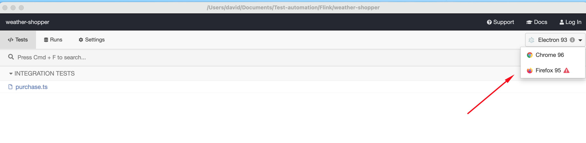

# weather-shopper

## Evaluation criteria
Define and write one manual end-to-end test cases which will be automated in next
steps.

These are some aspects we pay particular attention to:
- You can use any language/framework you are most comfortable with.
- Your solution must be independent of a particular OS.
- Your solution must support running tests in parallel.
- Your solution must support two different browsers.
- You must provide instructions on how to run the tests and any installation prerequisites.
- The tests in the provided solution must pass consistently and follow the initial steps.

Nice to have:
- The code should be documented and be easy-to-follow.
- The solution should be well structured.

## Solution

- Language/Framework: Cypress + TS
- Solution must be independent of a particular OS: Cypress can run across different OS and in CI pipelines
- Solution must support running tests in parallel: Currently, Cypress does not have a native method to run tests in parallel for local machine. There is a way to run tests in parallel but documentation recommends to use a CI server and a paid Cypress dashboard service.
- Solution must support two different browsers: In order to run the test in different browsers you have to install those browsers in your local machine. Cypress automatically recognize those browsers and let you select wich one will use when running the test.

Note: since web application has an iframe embedded in the checkout process it has been required to add `"chromeWebSecurity": false` configuration to allow browser JavaScript from one domain to access elements in another domain, this configuration will not work on firefox browser.

### Setup

Have the nodejs https://nodejs.org/en/ installed for your os.

Once installed go to the project's root folder and type on your terminal:

`npm install`

If you want to run the test using cypress test runner you can type:

`npm run cy:open`

On the other hand, if you want to run the test using the console you can type: `npm run cy:run`

And that’s it! Test should run with those commands.

### Test case: User is able to buy Moisturizers
1. User goes to weathershopper website (https://weathershopper.pythonanywhere.com/)
2. User check current temperature
3. If current temperature is below 19 degrees user clicks on _Buy moisturizers_ button
4. User lands in moisturizees page and check that current url contains /moisturizer
5. User adds two moisturizers to the cart. First, selects the least expensive moisturizer that contains Aloe. Then selects the least expensive moisturizer that contains almond
6. After selecting the proper moisturizers user checks that cart contains 2 items
7. User clicks on _cart_ button
8. User lands in checkout page and check that current url contains /cart
9. User clicks on _Pay with Card_ button
10. User fills the credit card details
11. User lands in confirmation page and check that current url contains /confirmation
12. User checks that there is a "PAYMENT SUCCESS" header and "Your payment was successful. You should receive a follow-up call from our sales team." subheader.
